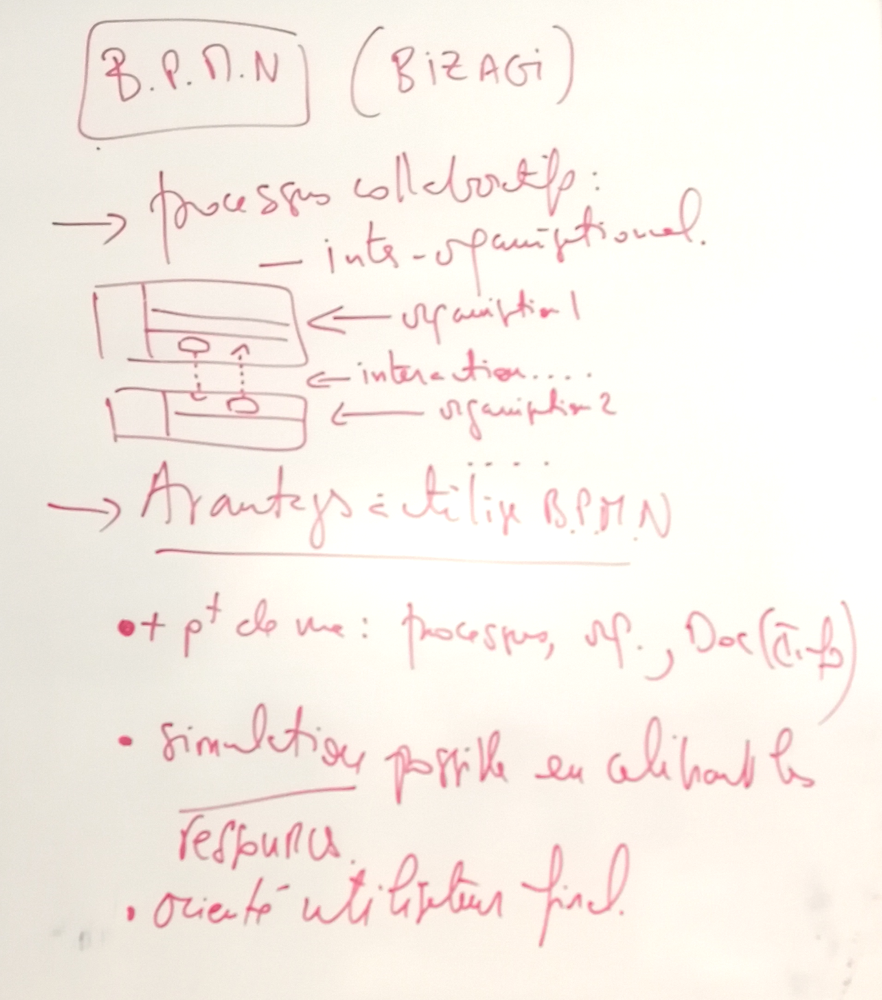

# TP 

## B.P.M.N

* Processus collaboratifs :
    * Inter organisationnel
    * Graph sous Bizagi

* Avantages à utiliser B.P.M.N
    * plusieurs points de vue : processus, departement, documentation sans être précis
    * Simulation possible en calibrant les ressources
    * Orienté utilisateur final

***
## En résumé :

